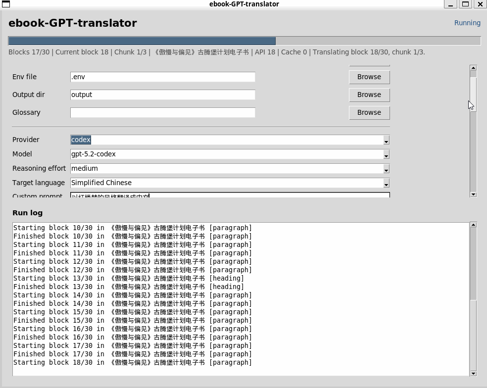

# ebook-GPT-translator

Modernized ebook translation toolkit for TXT, EPUB, DOCX, PDF, and optional MOBI input. Supports Codex, Claude Code, and Gemini CLI as local translation providers alongside OpenAI/Azure APIs. This version upgrades the original single-file project into a package with a real CLI, modern OpenAI SDK support, multi-provider support, resume cache, glossary handling, tests, and release-ready packaging.

[中文说明](README-zh.md)

## Demo



Direct link: [ebook.gif](./ebook.gif)

## What changed in v2

- Replaced the legacy global OpenAI API usage with client-based modern SDK integration
- Added provider abstraction for `openai`, `azure`, `compatible`, and offline `mock`
- Added resume-safe SQLite translation cache and manifest files
- Added configurable chunk and token limits for long books
- Added `settings.toml`, `.env`, and full legacy `settings.cfg` compatibility
- Added maintainable package layout under `src/`
- Added unit tests and GitHub Actions CI
- Preserved the old `text_translation.py` entrypoint as a compatibility wrapper

## Supported providers

- `codex`: local Codex CLI using your ChatGPT subscription login
- `claude`: Claude Code CLI using your Anthropic account (models: `claude-sonnet-4-6`, `claude-opus-4-6`, `claude-haiku-4-5-20251001`)
- `gemini`: Gemini CLI using your Google account (models: `gemini-3-pro-preview`, `gemini-3-flash-preview`, `gemini-2.5-pro`, `gemini-2.5-flash`, `gemini-2.5-flash-lite`)
- `openai`: official OpenAI API
- `azure`: Azure OpenAI deployment
- `compatible`: any OpenAI-compatible endpoint, including Venice.ai-style APIs
- `mock`: offline smoke testing without any API key

## Supported formats

- Input: `txt`, `md`, `epub`, `docx`, `pdf`
- Optional input: `mobi` with `pip install mobi`
- Output: translated `txt` and `epub`

## Installation

```bash
git clone https://github.com/jesselau76/ebook-GPT-translator.git
cd ebook-GPT-translator
python3 -m pip install -r requirements.txt
```

Optional MOBI support:

```bash
python3 -m pip install mobi
```

Optional XLSX glossary support:

```bash
python3 -m pip install openpyxl
```

## Quick start

Create config:

```bash
python3 -m ebook_gpt_translator init-config
```

Launch the desktop GUI:

```bash
PYTHONPATH=src python3 -m ebook_gpt_translator.gui
```

Or, after installation:

```bash
ebook-gpt-translator-gui
```

GUI notes:

- `Config file` is optional. Leave it empty to use the values currently selected in the GUI.
- Use a config file when you want to save a repeatable preset for provider, language, context window, and output options.
- The `Model` field in the GUI is a dropdown that updates automatically when you switch providers (Codex, Claude Code, or Gemini models).
- The `Target language` field in the GUI is a common-language dropdown, but you can still type a custom language.
- The GUI includes a `Custom prompt` box for style instructions such as `Translate into Chinese in a Dream of the Red Chamber style.`
- The GUI now shows live progress for both blocks and chunked sub-steps, so long files no longer appear frozen during translation.
- The GUI includes `Check resume` and `Resume previous job` actions. If translation is interrupted, rerun the same file and settings to continue from cached chunks while rebuilding the same consistency state.
- The GUI includes a `CLI Tools` panel showing install/auth status for Codex, Claude Code, and Gemini CLI with one-click login for each.

Run a real translation:

```bash
PYTHONPATH=src python3 -m ebook_gpt_translator translate book.epub \
  --config settings.toml \
  --provider codex \
  --model gpt-5.2-codex \
  --reasoning-effort medium \
  --target-language "Simplified Chinese"
```

Run with Codex subscription login:

```bash
PYTHONPATH=src python3 -m ebook_gpt_translator auth login --provider codex
PYTHONPATH=src python3 -m ebook_gpt_translator translate book.epub \
  --provider codex \
  --model gpt-5.2-codex \
  --reasoning-effort medium \
  --target-language "Simplified Chinese"
```

Run with Claude Code:

```bash
PYTHONPATH=src python3 -m ebook_gpt_translator auth login --provider claude
PYTHONPATH=src python3 -m ebook_gpt_translator translate book.epub \
  --provider claude \
  --model claude-sonnet-4-6 \
  --target-language "Simplified Chinese"
```

Run with Gemini CLI:

```bash
PYTHONPATH=src python3 -m ebook_gpt_translator auth login --provider gemini
PYTHONPATH=src python3 -m ebook_gpt_translator translate book.epub \
  --provider gemini \
  --model gemini-2.5-pro \
  --target-language "Simplified Chinese"
```

Run an offline smoke test:

```bash
PYTHONPATH=src python3 -m ebook_gpt_translator translate sample.txt \
  --provider mock \
  --target-language German
```

Save OpenAI credentials locally:

```bash
PYTHONPATH=src python3 -m ebook_gpt_translator auth login --provider openai
```

Default provider notes:

- The default provider is now `codex`
- The default model is `gpt-5.2-codex`
- The default reasoning effort is `medium`
- Long-form consistency is enabled by default with `context_window_blocks = 6`
- Chapter memory, rolling translated context, and automatic term memory are enabled by default
- Cross-chapter memory is persisted to a sidecar memory file and reused on reruns
- You can choose cheaper/faster Codex runs with `--reasoning-effort low`
- You can switch models with `--model`, for example `gpt-5.2-codex`, `gpt-5.1-codex`, or `gpt-5-codex-mini`
- You can override the rolling context size with `--context-window`
- The GUI exposes the same provider/model/context settings without requiring long CLI commands

Use Codex login status:

```bash
PYTHONPATH=src python3 -m ebook_gpt_translator auth status
```

List available models:

```bash
PYTHONPATH=src python3 -m ebook_gpt_translator list-models --source codex
PYTHONPATH=src python3 -m ebook_gpt_translator list-models --source claude
PYTHONPATH=src python3 -m ebook_gpt_translator list-models --source gemini
```

Use the legacy entrypoint:

```bash
PYTHONPATH=src python3 text_translation.py translate sample.txt --provider mock
```

## Azure OpenAI example

```toml
[provider]
kind = "azure"
model = "your-deployment-name"
api_key = "..."
api_base_url = "https://your-resource.openai.azure.com/"
api_version = "2024-02-01"
api_mode = "chat"
```

## OpenAI-compatible endpoint example

```toml
[provider]
kind = "compatible"
model = "llama-3.1-405b"
api_key = "..."
api_base_url = "https://api.example.com/v1"
api_mode = "chat"
```

## Key features

- `--skip-existing` skips files when translated outputs already exist
- The SQLite cache avoids repeated API calls and acts as the primary resume mechanism
- `--test` translates only the first few blocks for prompt validation
- Glossary CSV and XLSX files let you pin terminology before sending text to the model
- Chapter memory, rolling translated context, and automatic term memory are included by default to improve long-novel consistency
- Translation memory is persisted in `.cache/jobs/*.memory.json` for cross-chapter reuse and restarts
- All CLI providers (Codex, Claude Code, Gemini) request structured JSON output and parse the `translation` field, with automatic retry on empty responses
- `--txt-only` and `--epub-only` support lighter workflows
- Generated manifest files record outputs, config, and usage stats

## Configuration files

- `settings.toml.example`: recommended format
- `settings.cfg.example`: legacy-compatible `[option]` format from the original project
- `.env.example`: environment variable override reference
- `examples.glossary.csv`: sample glossary file
- `transliteration-list-example.xlsx`: original sample glossary workbook

## Development

Run tests:

```bash
PYTHONPATH=src python3 -m unittest discover -s tests -v
```

Package build:

```bash
python3 -m pip install -e .
```

## Star History

[](https://star-history.com/#jesselau76/ebook-GPT-translator&Date)
